# UiPluginUsings

## 說明
	使用requirejs完成的单页应用，主要是对UI框架及js,jquery插件的使用

## 风格
	以layui做为基础ui框架，采用metisMenu,tabsMenu(自我开发)插件实现横向、纵向菜单导航

## 效果图

1. dashboard
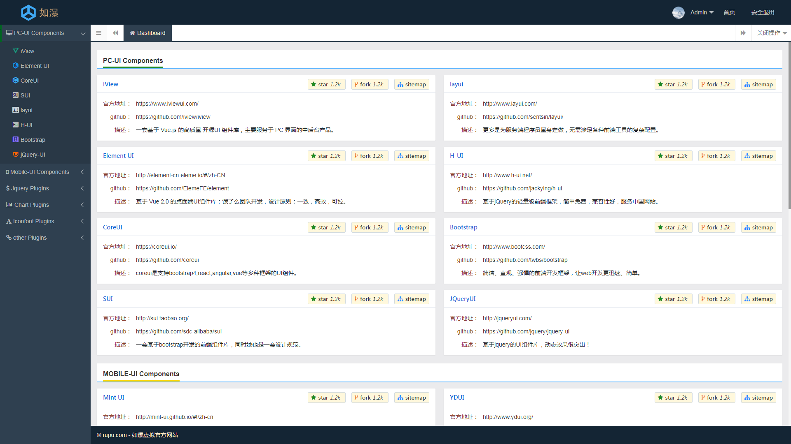

2. jquery 插件之 webuploader
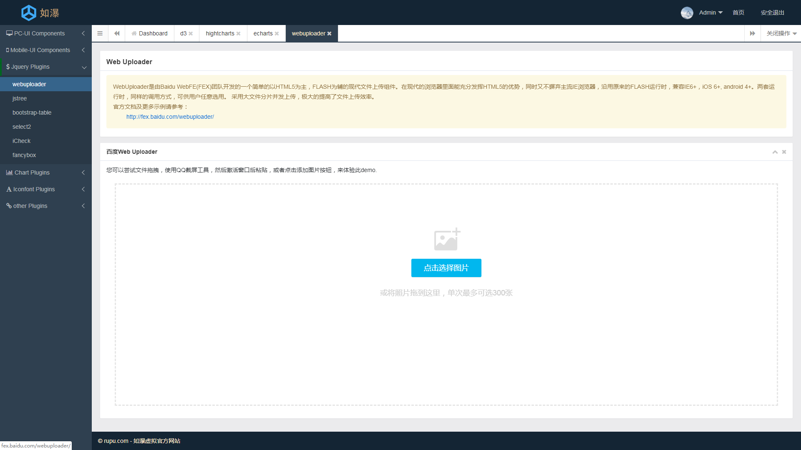

3. jquery 插件之 bootstrap-table
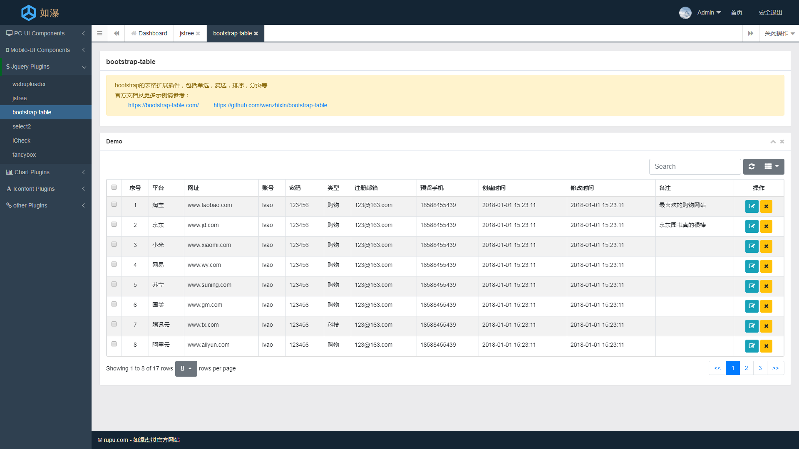

4. jquery 插件之 jstree
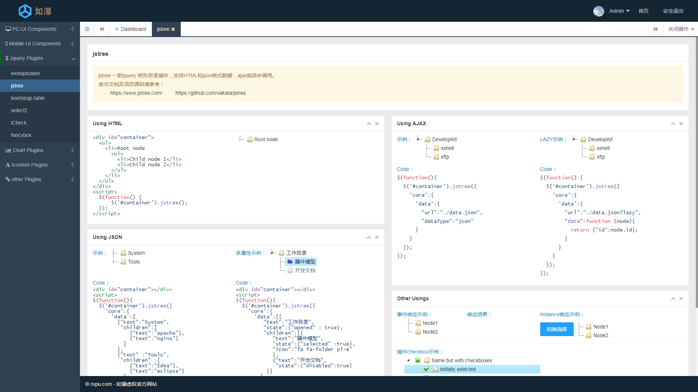

5. jquery 插件之 icheck
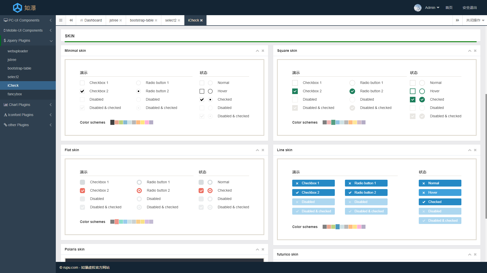

6. jquery 插件之 fancybox
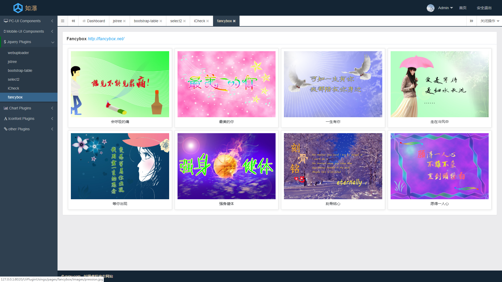

7. 数据可视化插件之 echarts
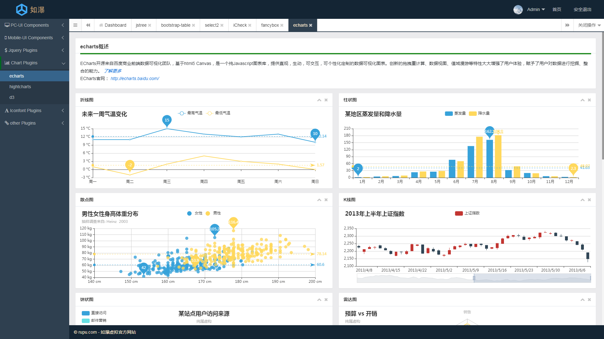

8. 数据可视化插件之 highcharts
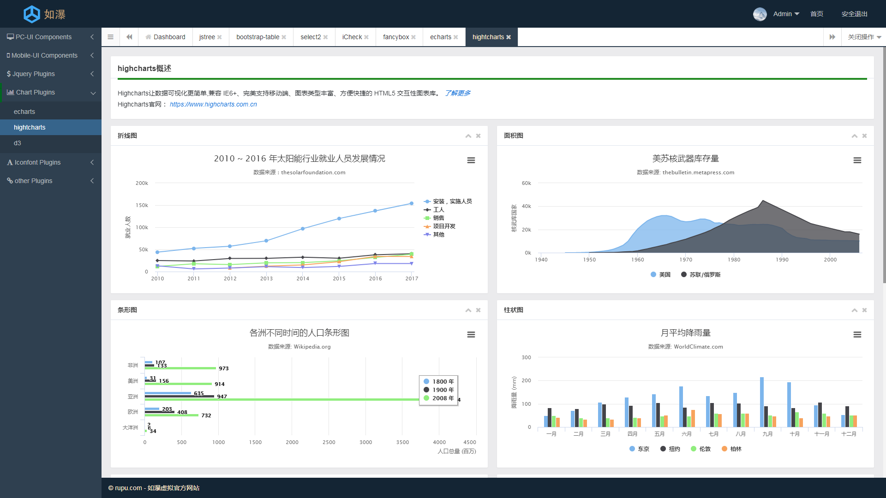

9. 数据可视化插件之 d3
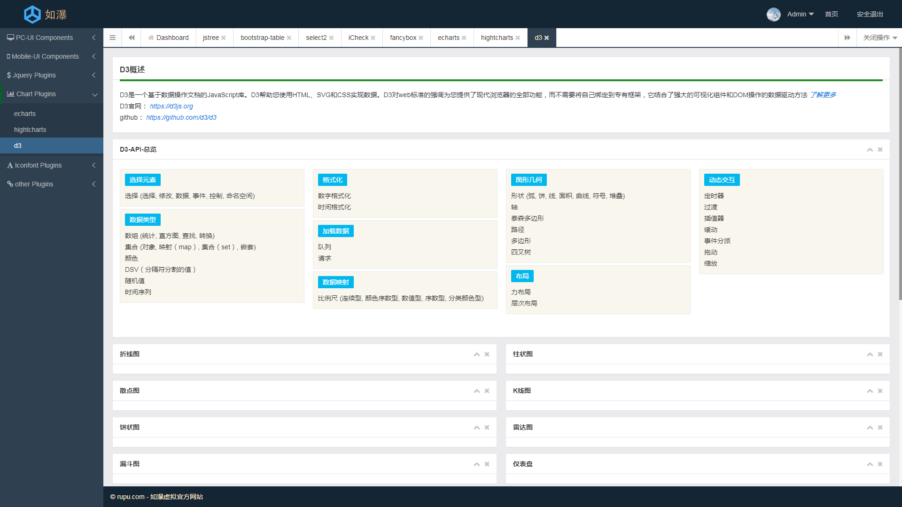

10. 字体图标之 fontawesome
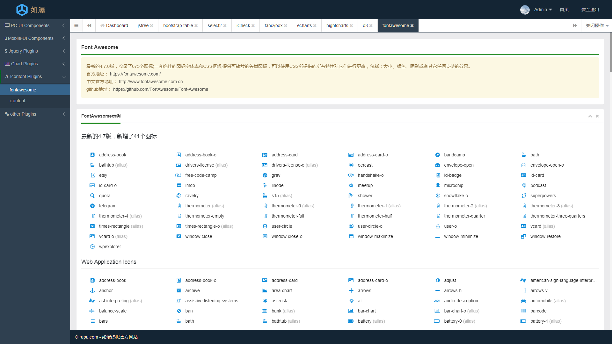

10. 字体图标之 iconfont
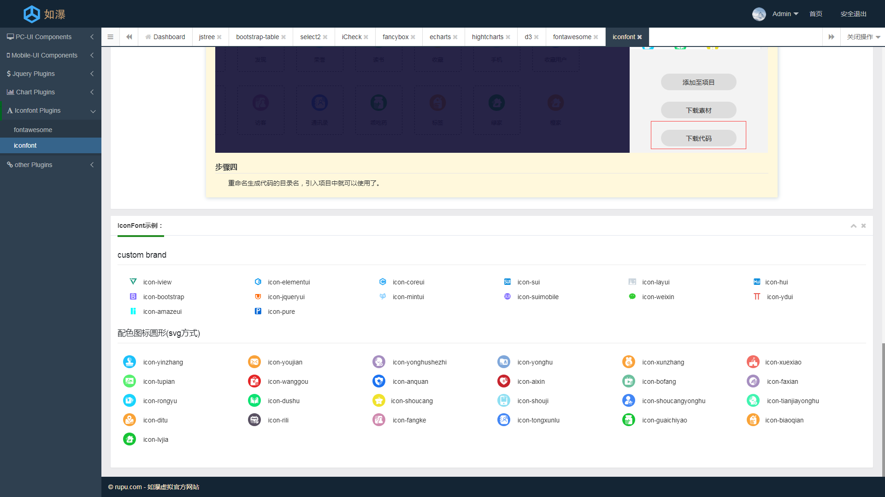

## 提示
	由于时间有限，还有许多ui框架介绍使用页面未完成...

## 使用方法
本项目是一个纯前端单页应用，主要是采用模块化开发的方式，所有需要依赖许多第三方库
重点就是对这些库的引用下载

	>1. 本地环境需要安装nodejs，安装 npm,安装方式可查阅百度
	>2. 项目clone之后，进入项目目录，使用命令行工具： npm install --save
	>3. 可以丢到nginx,apache 服务器中运行，也可在Hbuilder IDE工具中运行

